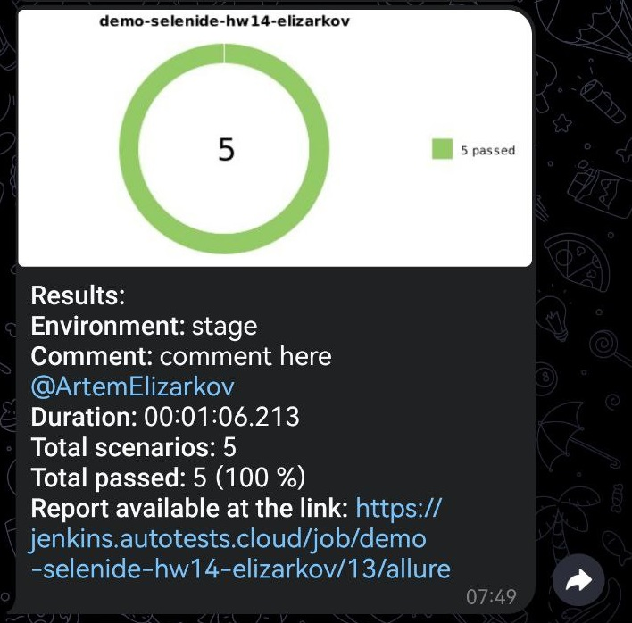

# Демопроект по автоматизации тестирования сайта [MTS Digital](https://mts-digital.ru/)
## Содержание:
* <a href='#tech'>Используемые технологии</a>  
* <a href='#test'>Примеры автоматизированных тест-кейсов</a>  
* <a href='#jenkins'>Тесты в Jenkins</a>
* <a href='#commands'>Консольные команды</a>
* <a href='#allure'>Allure и Allure TestOps</a>
* <a href='tg'>Отчетность в телеграмм бот</a>
* <a href='video'>Пример видео прохождения тестов в Selenoid</a>

<a id = 'tech'></a>
## Используемые технологии
<p align = 'center'>
<a href='https://www.java.com/'></a>
<a href='https://selenide.org/'></a>
<a href='https://github.com/'></a>
<a href='https://junit.org/junit5/'></a>
<a href='https://www.jenkins.io/'></a>
<a href='https://allurereport.org/docs/'></a>
<a href='https://gradle.org/'></a>
<a href='https://www.jetbrains.com/idea/'></a>
<a href='https://aerokube.com/selenoid/latest/'></a>
</p>

<a id = 'test'></a>
## Примеры автоматизированных тест-кейсов
* Проверка отображения и содержания заголовка главной страницы
* Проверка отображения ссылок выпадающего меню 'Технологии' в шапке сайта
* Проверка отображения ссылок выпадающего меню 'Работа у нас' в шапке сайта
* Открыть страницу Медиа по ссылки в шапке страницы. Проверить отображение заголовка Медиа
* Открыть страницу События по ссылке в шапке страницы. Проверить отображение заголовка События

<a id = 'jenkins'></a>
## Тесты в Jenkins

Тестовая сборка в [Jenkins](https://jenkins.autotests.cloud/job/demo-selenide-hw14-elizarkov/)


### Автотесты можно запускать со следующими параметрами
* браузер (по умолчанию chrome)
* версия браузера (по умолчанию 125.0)
* размер окна браузера (по умолчанию 1920x1080)
* окружение (по умолчанию stage)

<a id = 'commands"></a>
## Консольные команды
### Локальный запуск тестов
```bush 
gradle clean test
```

### Удаленный запуск тестов
```bush 
clean ${TASK} 
    -Dbrowser=${BROWSER} 
    -DbrowserSize=${SIZE} 
    -DbrowserVersion=${BROWSER_VERSION} 
    -Dwdhost=${WDHOST}
```

<a id = 'allure'></a>
## Отчетность в Allure и Allure TestOps
### Пример отчетности [Allure](https://jenkins.autotests.cloud/job/demo-selenide-hw14-elizarkov/allure/)


### Интеграция выполнения тестов с [Allure TestOps](https://allure.autotests.cloud/project/4489/dashboards)


<a id = 'tg'></a>
## Отчетность в телеграмм бот
После прохождения автотестов приходит сообщение в телеграмм бот


## Прохождение тестов в Selenoid

